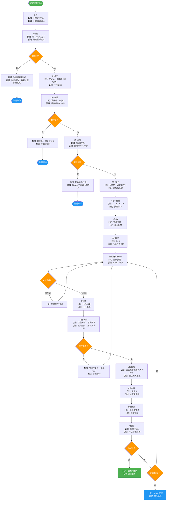

# ERT培训流程规范（Edraw重绘版 v3.0）

> 按「认知 → 流程 → 操作 → 演练 → 团队 → 工具」逻辑重新排序
> 合并去重：体位简化版+权威版合并；主流程+终点合并；Edraw建议合并
> 节点编号 N1～Nxx 可直接作为 Edraw 节点 ID

---

## 一、核心概念：两种体位与决策逻辑

### 1.1 两种体位核心区别

| 体位 | 为什么要做？ | 操作方向 | 一句话总结 |
|---|---|---|---|
| **复原体位** | 防止呕吐物呛到肺里 | 平躺 → 侧卧 | **拍肩没反应但有呼吸 → 侧身躺** |
| **复苏体位** | 为了做心肺复苏(CPR) | 趴睡 → 平躺 | **心脏停跳要做CPR → 翻过来躺平** |

### 1.2 快速决策树

```
发现无意识患者
    ↓
检查呼吸？
    ├── 有正常呼吸 → 复原体位（侧卧）
    │                 ↓
    │            监测呼吸，等待救援
    │
    └── 无呼吸/濒死呼吸 → 复苏体位（仰卧）
                          ↓
                     开始CPR
```

---

## 二、抢救主流程（含终点）

### N1 确认环境安全
► 观察上方（电线/坠物）、下方（湿滑/火源）、四周（交通/毒气）
► 不安全则先转移或等待，禁止贸然施救
↓
### N2 判断意识
► 方法：拍双肩、呼双耳（"喂！你怎么了？"）
► 时限：≤5 秒
↓
### N3 决策：有无意识？
├─ 有意识 → N4a 询问评估（受伤情况/主诉）
│           → N4b 评估呼吸与外伤
│           → N4c 必要时摆复原体位（侧卧，详见 §四）
│           → N_END3 监测等待专业救援
└─ 无意识 → N5 呼叫求援
↓
### N5 呼叫求援（三件事同时进行）
├─ N5a 拨打 120
├─ N5b 取 AED
└─ N5c 寻求会 CPR 者协助
↓
### N6 判断呼吸
► 方法：看胸廓起伏 5-10 秒
↓
### N7 决策：有无呼吸？
├─ 有呼吸 → N8a 摆复原体位（侧卧，详见 §四）
│           → N_END3 监测等待
└─ 无呼吸 → N8 评估脉搏
↓
### N8 评估脉搏
► 方法：成人/儿童触颈动脉；婴儿触肱动脉
► 时限：5-10 秒
↓
### N9 决策：有无脉搏？
├─ 有脉搏 → N9a 仅人工呼吸
│           ► 成人 10-12 次/分；儿童/婴儿 12-20 次/分
│           → N_END3 监测等待
└─ 无脉搏 → N10 启动 CPR
↓
### N10 启动 CPR
► 顺序：C（按压）→ A（开放气道）→ B（人工呼吸）
► 参数详见 §五
↓
### N11 胸外按压（30 次）
↓
### N12 开放气道
► 仰头抬颏法；怀疑颈椎损伤用推举下颌法
↓
### N13 人工呼吸（2 次）
↓
### N14 决策：AED 是否到达？
├─ 未到达 → N15 完成 5 个 30:2 循环 → N16 重新评估 → 回到 N11
└─ 已到达 → N20 进入 AED 流程（见 §三）
↓
（AED 完成后回到 N11 继续按压）
↓
### N_END1 决策：是否恢复自主循环（ROSC）？
├─ 是 → N_END1a 复苏后监护 → N_END2 等待专业救援
├─ 否 → 继续CPR循环 → 回到 N11
└─ 力竭 / 专业救援到达 → N_END2 交接

### 流程终点（3 种出口）

| 终点编号 | 条件 | 后续动作 | 建议颜色 |
|---|---|---|---|
| N_END1 | ROSC（恢复自主循环：呼吸/咳嗽/肢体活动） | 复苏后监护，保持复原体位，等待救援 | 绿色 |
| N_END2 | 专业救援（120/医院）到达 | SBAR 交接，转为协助 | 蓝色 |
| N_END3 | 施救者力竭或持续无循环 | 换人继续或由专业团队判定终止 | 灰色 |

---

## 三、AED 标准流程（N20 子流程）

### N20 AED 到达
↓
### N20a 打开电源
► 按 AED 语音提示操作
↓
### N20b 贴电极片
► 位置：右侧锁骨下 + 左侧腋中线
► 贴片时不中断 CPR
↓
### N20c AED 分析心律
► 提示："正在分析心率，请不要接触患者"
► 所有人离开患者
↓
### N20d 决策：是否建议电击？
├─ 不建议电击 → N20e 立即继续 CPR → 回到 N11
└─ 建议电击 → N20f
↓
### N20f 准备电击
► 提示："建议电击除颤，请不要接触患者"
► 再次确认无人接触患者
↓
### N20g 按下电击键
↓
### N20h 立即继续 CPR
► 放电完成，继续按压，不暂停评估脉搏
→ 回到 N11，继续 5 个循环后 AED 再次分析

---

## 四、体位操作详解

> 合并简化版对比表 + 权威指南标准步骤
> 基于 AHA/ARC 2024、ERC 2025、NHS、ILCOR 2020 指南

### 4.1 操作步骤对比表（快速查阅）

| 操作环节 | 复原体位（平躺 → 侧卧） | 复苏体位（趴睡 → 平躺） |
|---|---|---|
| **【适用场景】** | 患者有意识/呼吸，但叫不醒，担心他呕吐呛到。 | 患者心脏骤停（没呼吸没反应），必须翻过来做CPR。 |
| **【1. 站位】** | 站/跪在患者**侧面**（左/右皆可），面朝患者。 | 站/跪在患者**侧面**（左/右皆可），面朝患者。 |
| **【2. 双手分工】** | • **一只手**放后背中间（肩胛骨附近），用来**推**<br>• **另一只手**轻握**下巴**，用来控制头部 | • **一只手**放在**脖子后面**，牢牢**固定颈部**<br>• **另一只手**放在**胸前**（两乳头连线附近） |
| **【3. 核心动作】** | **推+引**：<br>用背那手推患者向你这边，同时握下巴的手引导头转向侧面。 | **托+翻**：<br>用手托住脖子，同时胸前的手用力推，将患者翻成侧面。 |
| **【进阶动作】** | — | **再翻平**：<br>顺势将患者从侧面翻成**平躺**姿势，脸朝上。 |
| **【4. 翻转后调整】** | • **垫头/抬头**：确保头稍后仰，嘴巴能张开<br>• **检查**：确认没压着手臂，呼吸顺畅 | • **摆正体位**：确保平躺，身体伸直，手臂放两侧<br>• **立刻准备CPR**：摆好后立即开始胸外按压 |
| **【关键要领】** | 让患者像一根**圆木**一样滚过来，保持头-颈-身体一条直线。 | **全程用手托住脖子**，不要让头突然甩动，保护颈椎。 |

---

### 4.2 复原体位标准7步法（AHA 2a级推荐）

**【适用】** 无意识但呼吸正常、无颈椎损伤风险的患者

| 步骤 | 操作内容 | 技术要点 |
|:---:|---|---|
| **1** | 跪于患者侧旁 | 双膝跪地，与患者肩部平行 |
| **2** | 伸展近端手臂 | 将靠近你的手臂伸直，与身体呈90°角，掌心向上 |
| **3** | 交叉远端手臂 | 将远侧手臂横过胸前，手背贴于患者近侧脸颊 |
| **4** | 弯曲远端膝盖 | 将远侧膝盖弯曲约90°，脚掌平放地面 |
| **5** | 拉动翻转 | 以弯曲的膝盖为支点，将患者向你这边拉动翻转 |
| **6** | 调整稳定 | 患者侧卧后，调整上方膝盖使其弯曲90°，上方腿与身体呈三角支撑 |
| **7** | 开放气道 | 轻拉头部后仰，抬起下巴，确保气道通畅 |

**关键要求**
- **稳定三角**：上方手臂支撑头部，上方膝盖支撑身体，防止回翻
- **气道开放**：头部后仰角度适中，避免过度伸展
- **监测呼吸**：摆好后持续监测呼吸，每30分钟换侧

---

### 4.3 复苏体位标准6步法（AHA 1级推荐）

**【适用】** 心脏骤停、需要CPR的患者

| 步骤 | 操作内容 | 技术要点 |
|:---:|---|---|
| **1** | 跪于患者侧旁 | 双膝跪地，与患者肩部平行 |
| **2** | 托住颈部 | 一手托住患者颈后部，保持头-颈-躯干在同一轴线 |
| **3** | 翻转侧面 | 将患者从趴位翻至侧卧位（脊柱保护） |
| **4** | 翻成平躺 | 立即将患者翻成仰卧位，面部朝上 |
| **5** | 调整体位 | 确保患者平躺于**硬平面**（木板/地面） |
| **6** | 开放气道 | 仰头抬颏法开放气道 |

**关键要求**
- **脊柱保护**：翻转过程中始终保持头-颈-躯干直线
- **硬平面**：禁止在软床/沙发上进行CPR
- **快速完成**：整个翻转过程应在5-10秒内完成

---

### 4.4 禁忌与特殊情况

| 情况 | 复原体位处理 | 复苏体位处理 |
|---|---|---|
| 怀疑颈椎/脊柱损伤 | **禁止翻转**，保持原位等待专业人员 | 2人协作：1人固定颈椎，1人翻转 |
| 孕妇（>20周） | 左侧卧（避免压迫下腔静脉） | 同常规，注意左侧子宫推移 |
| 肥胖患者 | 需要额外人手协助 | 需要额外人手协助 |
| 患者呕吐 | 立即清理口腔，防止误吸 | 翻转后立即清理 |
| 侧躺患者 | 直接调整成标准侧卧 | 直接翻成仰卧位 |
| 坐轮椅患者 | 转移至地面 | 将轮椅放倒或转移至地面 |

---

### 4.5 关键安全提示

⚠️ **绝对不能做的事**
- **颈椎怀疑受伤**时（如车祸、高空坠落），**绝对不能自己乱翻**！必须等专业人员用硬板固定。
- **扭转脊柱**：翻转时不能像拧麻花一样转身体，必须保持从头到脚一条直线。

⚠️ **复原体位注意**
- 不要硬拽患者的胳膊或衣服。
- 侧卧后确保下方的耳朵、手臂没有被压得太紧。

⚠️ **复苏体位注意**
- 翻成平躺后，**立刻检查呼吸和脉搏**。
- 准备好按压板/硬地面，在软床上做CPR没用。

---

## 五、CPR参数速查表

### 5.1 胸外按压参数（成人 / 儿童 / 婴儿对照）

| 项目 | 成人 | 儿童（1 岁～青春期） | 婴儿（<1 岁） |
|---|---|---|---|
| 按压位置 | 两乳头连线中点（胸骨下半部） | 两乳头连线中点 | 两乳头连线中点下方 |
| 按压手法 | 双手掌根叠放，十指相扣，手臂垂直，肘关节锁死 | 单手掌根 | 食指与中指（或双手拇指环绕法） |
| 按压深度 | 5-6 cm | 约 5 cm（胸廓 1/3） | 约 4 cm（胸廓 1/3） |
| 按压频率 | 100-120 次/分 | 100-120 次/分 | 100-120 次/分 |
| 按压比例 | 30:2 | 30:2（单人）/ 15:2（双人） | 30:2（单人）/ 15:2（双人） |
| 完全回弹 | 必须 | 必须 | 必须 |
| 按压中断 | <10 秒 | <10 秒 | <10 秒 |

### 5.2 人工呼吸参数

| 项目 | 标准 |
|---|---|
| 吹气时间 | 每次 1 秒 |
| 吹气量 | 以胸廓抬起为准，避免过度通气 |
| 吹气间隙 | 松开鼻孔让其呼气 |
| 有脉搏无呼吸频率 | 成人 10-12 次/分；儿童/婴儿 12-20 次/分 |

### 5.3 评估参数

| 评估项 | 方法 | 时限 |
|---|---|---|
| 判断意识 | 拍双肩、呼双耳 | ≤5 秒 |
| 判断呼吸 | 看胸廓起伏 | 5-10 秒 |
| 评估脉搏（成人/儿童） | 颈动脉 | 5-10 秒 |
| 评估脉搏（婴儿） | 肱动脉 | 5-10 秒 |
| CPR 重新评估时机 | 每 5 个 30:2 循环后（约 2 分钟） | — |

### 5.4 AED 参数

| 项目 | 标准 |
|---|---|
| 电极片位置（成人/儿童） | 右侧锁骨下 + 左侧腋中线（或前-后位） |
| 电极片位置（婴儿） | 前-后位（胸前 + 背后） |
| 能量（成人） | 制造商推荐（通常 200 J 双相） |
| 能量（儿童） | 2-4 J/kg（首选儿童电极片/儿童钥匙） |
| 分析心律时 | 所有人离开患者 |
| 电击时 | 所有人离开患者，按下电击键 |

---

## 六、施救者「说+做」时间轴

> 以施救者视角，按时间轴展示每一步**说什么、做什么**
> 用于培训实操演练与角色扮演

### 6.1 时间轴对照表

| 时间节点 | 施救者【说】 | 施救者【做】 |
|:---:|---|---|
| **0秒** | （自语）"环境安全吗？" | 环顾上下四周，确认无危险 |
| **0-5秒** | "喂！喂！你怎么了？" | 拍双肩、呼双耳 |
| **5-10秒** | （判断）"无意识！" | 转向周围："快来人帮忙！请帮我打120，拿AED！" |
| **10-15秒** | "看胸廓起伏...5、6、7、8、9、10" | 观察患者胸廓起伏5-10秒 |
| **15-20秒** | "无呼吸！检查脉搏..." | 触摸颈动脉5-10秒 |
| **20-25秒** | "无脉搏！开始CPR！" | 双手定位：两乳头连线中点 |
| **25秒-1分钟** | （默数节奏）"1、2、3...30" | 胸外按压30次（100-120次/分，深度5-6cm） |
| **1分钟** | （口令）"开放气道！" | 仰头抬颏法开放气道 |
| **1分-1分05秒** | （吹气）"1...2" | 人工呼吸2次（每次1秒，见胸廓抬起） |
| **1分05秒-2分钟** | "继续按压！1、2、3...30" | 重复30:2循环，共5个循环 |
| **2分钟** | "AED到了吗？" | AED到达→开启AED |
| **2分05秒** | （跟读AED语音）"正在分析，请不要接触患者！" | 所有人离开，AED分析心律 |
| **2分15秒** | "建议电击！所有人离开！" | 确认无人接触患者 |
| **2分20秒** | "电击！" | 按下电击键 |
| **2分25秒** | "继续CPR！" | 立即恢复按压，不评估脉搏 |
| **4分钟** | "重新评估...5、6、7、8、9、10" | 5个循环后再次评估呼吸脉搏 |
| **持续** | "坚持住！救援马上到！" | 每2分钟换人按压，持续至ROSC或救援到达 |

### 6.2 流程图（Mermaid 语法）

> 复制以下代码到 [Mermaid Live Editor](https://mermaid.live) 或支持Mermaid的编辑器预览



---

## 七、ERT团队衔接

### 7.1 介入时机
- ERT 到达现场即接管 CPR
- 与第一目击者快速交接

### 7.2 ERT 职责
- 持续高质量 CPR（每 2 分钟轮换，避免疲劳）
- AED 操作与心律分析
- 生命体征监测
- 与 120 / 医院交接

### 7.3 SBAR 交接内容

| 项 | 内容 |
|---|---|
| S（现状） | 发病时间、地点、目击/非目击骤停 |
| B（背景） | 既往病史、用药史、过敏史 |
| A（评估） | 已做 CPR 时长、AED 放电次数、当前心律 |
| R（建议） | 已采取措施、待办事项 |

---

## 八、Edraw绘制建议

### 8.1 主流程与结构
1. **主流程**：纵向流程图，决策点（N3/N7/N9/N14/N_END1）用菱形
2. **分支**：用 ├─ └─ 树形展开，避免长横线交叉
3. **AED 子流程**：独立子流程框（N20），主流程引用调用
4. **参数表**：用表格节点或独立子页，与对应步骤用虚线关联
5. **ERT 衔接**：横向泳道图（第一目击者 / ERT / 120）
6. **终点**：圆角矩形，按颜色区分（绿/蓝/灰）
7. **危险提示**：如"怀疑颈椎损伤禁翻转，改用推举下颌法"用红色警告框标注在 N12 旁
8. **"五到"**（眼/嘴/耳/手/心）作为态度注记贯穿全程，可在主流程左侧设纵向标注栏

### 8.2 「说+做」时间轴绘制
1. **泳道图布局**：横向时间轴，左侧标注"施救者"，每列代表一个时间节点
2. **双框节点**：每个节点内分两行——上行"说"（用对话气泡图标）、下行"做"（用动作图标）
3. **颜色编码**：
   - 评估判断：橙色菱形
   - 操作动作：蓝色矩形
   - 决策分支：黄色菱形
   - 终点：绿色/蓝色圆角矩形
4. **时间轴标注**：在流程图顶部加横向时间刻度（0s / 5s / 10s / 1min / 2min / 4min）
5. **语音气泡**：所有"说"的内容用对话气泡形状，强化"口语化"特征
6. **循环箭头**：CPR循环用回环箭头标注"5个循环≈2分钟"

---

## 九、参考资源

| 资源名称 | 链接 | 发布时间 |
|---|---|---|
| AHA/ARC 2024 First Aid Guidelines | https://cpr.heart.org/en/resuscitation-science/first-aid-guidelines/first-aid | 2024 |
| NHS Recovery Position Guide | https://www.nhs.uk/conditions/first-aid/recovery-position/ | 2024 |
| ERC 2025 First Aid Guidelines | https://www.novaambulans.com/en/blog/recovery-position-step-by-step | 2025 |
| 中华医学会心肺复苏科普 | https://www.cma.org.cn/art/2024/8/12/art_4584_57995.html | 2024 |
