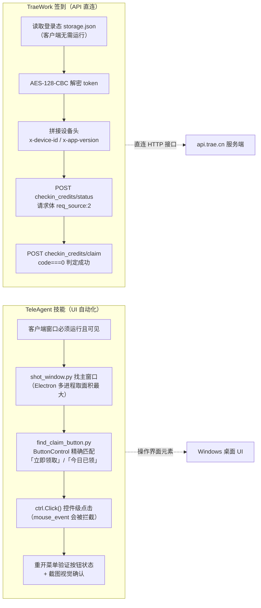

---
AIGC:
  ContentProducer: '001191110102MAD55U9H0F10002'
  ContentPropagator: '001191110102MAD55U9H0F10002'
  Label: '1'
  ProduceID: '8df7fc60-b63f-484b-be4f-6cce81fbff7a'
  PropagateID: '8df7fc60-b63f-484b-be4f-6cce81fbff7a'
  ReservedCode1: 'a19e2c17-fbb8-46c6-b63e-da301a80b93b'
  ReservedCode2: 'a19e2c17-fbb8-46c6-b63e-da301a80b93b'
---

# TeleAgent 签到 与 TraeWork 签到 实现对比

> 生成日期：2026-09-16
> 对比对象：
> - **A. TeleAgent 签到**：teleagent-points-claimer 技能（已完成 Skill 打包），领取「积分福利社」每日 100 积分
> - **B. TraeWork 签到**：TraeWork每日自动签到.zip（checkin.js + run_checkin.cmd + SKILL.md），领取 TraeWork CN 每日积分

---

## 一、一句话概括

| 实现 | 概括 |
|------|------|
| **TeleAgent 签到（Skill）** | **UI 自动化路线**：通过 Windows UI Automation 框架操控桌面客户端界面，模拟用户点击「立即领取」按钮完成签到 |
| **TraeWork 签到** | **API 直连路线**：读取客户端登录态文件 → 本地解密 token → 直接调用官方 HTTP 签到接口完成签到 |

**本质区别：一个"操作界面"，一个"调接口"。**

---

## 二、两套实现的核心链路

### A. TeleAgent 签到（Skill 版，UI 自动化）

```
TeleAgent 桌面客户端（Electron/Chromium）
        ↓  Chromium 可访问性树 → Windows UIA 桥接
uiautomation 库（Python，封装 UIAutomationCore.dll）
        ↓  ButtonControl 精确匹配「立即领取」
ctrl.Click() 控件级点击（InvokePattern）
        ↓  等待 2 秒 → 重新打开账户菜单
复查按钮变「今日已领」 + 截图视觉确认天数+1
        ↓
写入当日记忆日志（memory-manager）
```

### B. TraeWork 签到（API 直连）

```
读取 %APPDATA%\TRAE SOLO CN\User\globalStorage\storage.json
        ↓  提取加密登录态 iCubeAuthInfo://icube.cloudide
AES-128-CBC 解密（SHA-512 密钥派生 + HMAC 校验）
        ↓  得到 Cloud-IDE-JWT token
读取设备 ID（ModularData\ckg_server\local_env.json 的 device_id）
        ↓  补齐设备请求头 + req_source:2
POST api.trae.cn 签到接口（status 检查 → claim 领取）
        ↓  code===0 判定成功，再刷新 status 拿最新积分
输出「签到成功！积分：XXX」到 checkin.log
```

---

## 三、Mermaid 对比流程图



---

## 四、逐维度对比

| 对比维度 | TeleAgent 签到（Skill） | TraeWork 签到 |
|---------|------------------------|---------------|
| **技术路线** | Windows UI 自动化（UIAutomation 框架） | 逆向官方接口，HTTP API 直连 |
| **依赖环境** | Python + uiautomation/psutil/pillow/pywin32 | Node.js（或复用 TRAE 自带的 Electron 以 `ELECTRON_RUN_AS_NODE=1` 运行） |
| **客户端状态要求** | **客户端必须正在运行**且窗口未被最小化 | 客户端**不需要运行**，只需登录态文件存在且未过期 |
| **界面依赖** | 依赖 UI 结构（左下角账户入口 → 积分福利社 → 立即领取），界面改版即失效 | 不依赖界面，依赖接口协议（参数/设备头变化会失效） |
| **鉴权方式** | 无（用户已登录，操作走真实客户端会话） | 解密本地 token → `Authorization: Cloud-IDE-JWT xxx` |
| **风控对抗** | 天然绕过：点击路径与真实用户操作完全一致 | 逆向补齐参数：`req_source=2` + 数字设备 ID，缺参报 9004，错 ID 报 9074 |
| **结果验证** | 双重验证：按钮状态变「今日已领」 + 截图视觉模型确认天数+1 | 单一验证：接口 `code===0`，再调 status 刷新积分数字 |
| **失败模式** | `failed_no_window`（客户端未启动）<br/>`failed_missing_button`（界面改版）<br/>`failed_verify`（点击后未验证通过） | code 9004（下单参数错误）<br/>code 9074（参与用户太多，风控）<br/>登录态过期 |
| **输出形式** | JSON 结果 + 截图留档 + 日志记忆 | 控制台中文输出 + 追加写 checkin.log |
| **定时集成** | Scheduler 技能创建 cron 任务（默认每天 07:50） | Windows 任务计划程序「每日签到」（每天 00:10 + 开机登录双触发器） |
| **交付形态** | 已打包为 Skill（SKILL.md + 5 个 Python 脚本） | 文件夹 zip（SKILL.md + checkin.js + run_checkin.cmd） |
| **优点** | 不依赖接口协议、不触碰登录态、通用性强（界面操作与真人一致） | 无需窗口、无需点击、速度快、可完全后台静默运行 |
| **缺点** | 依赖窗口可见、Electron 交互坑多、界面改版要重定位 | 依赖逆向协议、登录态过期需人工重登、接口变更即失效 |

---

## 五、关键技术点差异详解

### 1. "点击"与"请求"的本质差异

| | TeleAgent | TraeWork |
|---|---|---|
| 触发签到 | 在 UI 控件上执行 InvokePattern（控件级点击） | HTTP POST 到 `https://api.trae.cn/trae/api/v2/ug/checkin_credits/claim` |
| 底层通道 | Windows 可访问性（UIA COM 接口） | HTTPS 网络请求 |
| 失败兜底 | 坐标点击（`mouse_event`，Electron 下不可靠） | 无（接口失败即失败） |

### 2. 身份识别的差异

- **TeleAgent**：依赖桌面客户端已登录用户（本机用户名「肖洋」），脚本不做任何身份解析，直接操作当前会话。
- **TraeWork**：必须自己解密 token + 设备 ID。设备 ID 必须是 `local_env.json` 里的**纯数字 ID**（如 `1963102595468793`），用 storage.json 里的 UUID（`telemetry.devDeviceId`）会触发风控 9074——这是 Trae 签到踩坑最多的地方。

### 3. 验证链路的差异

- **TeleAgent**：双通道验证（UI 属性 + 视觉模型），在自动化环境中可靠性更高。
- **TraeWork**：单通道验证（接口返回值），claim 接口不返回积分，还需二次调 status 刷新。

### 4. 定时任务的差异

- **TeleAgent**：由 Scheduler 技能管理（cron 表达式，默认每天 07:50），任务内容直接调用技能。
- **TraeWork**：由 Windows 任务计划程序管理（`Register-ScheduledTask`，每天 00:10 + 登录后触发），执行 `cmd.exe /s /c ""脚本" >> 日志" 2>&1"`，日志追加到 `checkin.log`。

---

## 六、适用场景建议

| 场景 | 推荐方案 |
|------|----------|
| 桌面客户端始终常驻、每天开机的用户 | TeleAgent Skill（UI 自动化，稳定且无风控风险） |
| 客户端无需常开、希望完全后台运行 | TraeWork API 直连（只要登录态在即可） |
| 追求低资源占用（无窗口交互） | TraeWork（Node 一次性进程，秒级完成） |
| 界面结构稳定、不想依赖逆向协议 | TeleAgent Skill |
| 需要界面改版兜底/改 UI 结构 | TeleAgent（重新定位即可） vs TraeWork（需重新逆向） |

---

## 七、总结

两者都能实现"每日自动签到领积分"，但设计哲学不同：

- **TeleAgent 签到走的是"模拟人"路线**：把桌面 UI 当成操作对象，依赖 UIA 控件树，稳但重（要开窗口）。
- **TraeWork 签到走的是"模拟机器"路线**：逆向协议直连 API，轻量后台运行，但依赖登录态解密和接口参数还原，维护成本在"接口风控"侧。

如果从"少踩坑"角度选，**UI 自动化对协议变化免疫、对界面变化敏感；API 直连对界面变化免疫、对协议变化敏感**——两者互为补充，是最常见的自动化签到双路线范式。

---

*本文档由对比分析生成，TeleAgent 侧依据 teleagent-points-claimer 技能，Trae 侧依据 TraeWork每日自动签到.zip 内脚本与说明。*

> AI生成