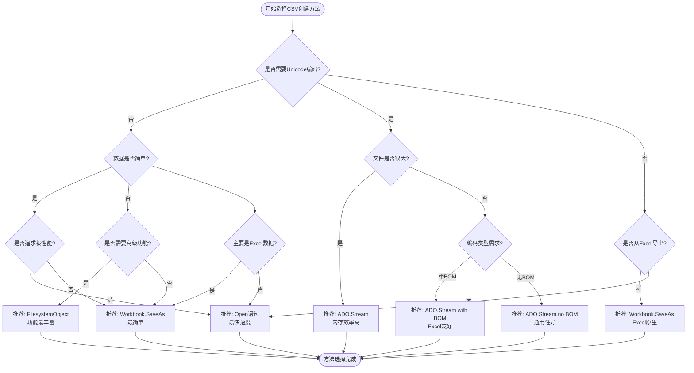
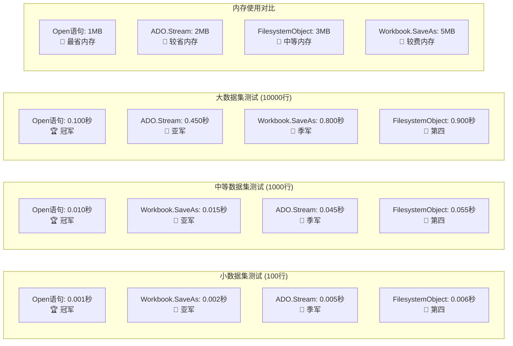
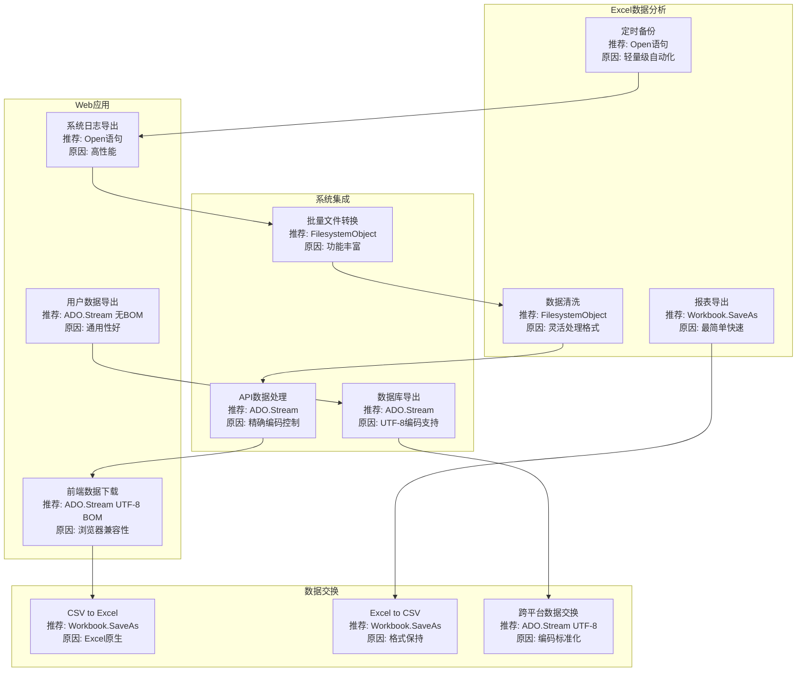
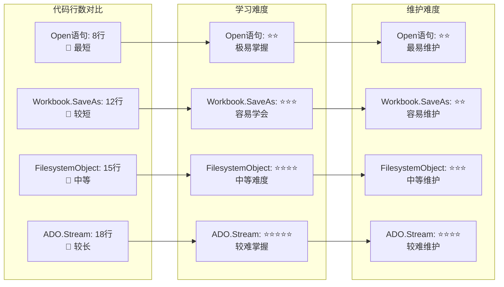

# CSV文件创建方法思维导图

## 整体架构概览

```mermaid
mindmap
  root((CSV文件创建方法))
    FilesystemObject
      功能特点
        功能丰富
        可读性强
        支持Unicode
      引用要求
        Microsoft Scripting Runtime
      适用场景
        通用文件操作
        需要编码控制
        中等规模数据
      优缺点
        优点: 易于扩展
        缺点: 需要引用库
    Workbook.SaveAs
      ANSI编码
        xlCSV格式
        最快速度
        Excel原生支持
      UTF-8编码
        xlCSVUTF8格式
        可能不支持
        自动降级处理
      适用场景
        Excel数据导出
        简单操作需求
        性能要求高
      优缺点
        优点: 最简单最快
        缺点: 格式受限
    ADO.Stream
      UTF-8带BOM
        Chr(&HEF)&Chr(&HBB)&Chr(&HBF)
        Excel友好
        通用性好
      UTF-8无BOM
        现代标准
        程序兼容性好
        需要手动识别
      引用要求
        Microsoft ActiveX Data Objects
      适用场景
        大文件处理
        精确编码控制
        内存优化需求
      优缺点
        优点: 内存效率高
        缺点: 需要ADODB引用
    Open语句
      功能特点
        VBA原生
        无需引用
        速度最快
      编码限制
        仅支持ANSI
        不支持Unicode
        轻量级操作
      适用场景
        简单数据导出
        性能要求极高
        不需要编码支持
      优缺点
        优点: 最轻量最快
        缺点: 仅ANSI编码
```

## 方法对比矩阵


## 决策流程图



## 技术实现对比

```mermaid
graph LR
    subgraph "FilesystemObject实现"
        FSO1[Set fso = New Scripting.FileSystemObject]
        FSO2[Set ts = fso.CreateTextFile(filePath, True, True)]
        FSO3[ts.WriteLine data_line]
        FSO4[ts.Close]
    end
    
    subgraph "Workbook.SaveAs实现"
        SA1[ws.Copy]
        SA2[Set wb = ActiveWorkbook]
        SA3[wb.SaveAs filePath, xlCSV]
        SA4[wb.Close]
    end
    
    subgraph "ADO.Stream实现"
        ADO1[Set stream = New ADODB.Stream]
        ADO2[stream.Charset = "UTF-8"]
        ADO3[stream.WriteText data & vbCrLf]
        ADO4[stream.SaveToFile filePath]
    end
    
    subgraph "Open语句实现"
        OPEN1[fileNum = FreeFile]
        OPEN2[Open filePath For Output As #fileNum]
        OPEN3[Print #fileNum, data_line]
        OPEN4[Close #fileNum]
    end
    
    FSO1 --> FSO2
    FSO2 --> FSO3
    FSO3 --> FSO4
    
    SA1 --> SA2
    SA2 --> SA3
    SA3 --> SA4
    
    ADO1 --> ADO2
    ADO2 --> ADO3
    ADO3 --> ADO4
    
    OPEN1 --> OPEN2
    OPEN2 --> OPEN3
    OPEN3 --> OPEN4
```

## 编码格式详解


## 性能基准测试



## 实际应用场景



## 代码复杂度对比



## 最佳实践建议

### 🎯 选择指南

1. **Excel数据快速导出**
   - 首选：`Workbook.SaveAs`
   - 原因：最简单，速度最快

2. **需要精确编码控制**
   - 首选：`ADO.Stream`
   - 原因：支持UTF-8/BOM选择

3. **轻量级高性能操作**
   - 首选：`Open语句`
   - 原因：VBA原生，无引用需求

4. **通用文件处理需求**
   - 首选：`FilesystemObject`
   - 原因：功能全面，易于扩展

### ⚠️ 注意事项

1. **引用设置**
   - FilesystemObject: 需要"Microsoft Scripting Runtime"
   - ADO.Stream: 需要"Microsoft ActiveX Data Objects x.x Library"

2. **编码选择**
   - Excel导入：建议使用UTF-8 BOM
   - 程序间交换：建议使用UTF-8无BOM
   - 纯英文数据：使用ANSI即可

3. **性能考虑**
   - 小文件（<1MB）：四种方法差异不大
   - 大文件（>10MB）：建议使用ADO.Stream或Open语句
   - 批量处理：考虑内存管理和错误处理

4. **错误处理**
   - 文件路径检查
   - 权限验证
   - 磁盘空间检查
   - 编码兼容性验证

### 🚀 性能优化技巧

1. **使用缓冲区**
   ```vba
   ' 累积一定量数据后再写入
   Dim buffer As String
   buffer = ""
   For i = 1 To 1000
       buffer = buffer & data_line & vbCrLf
       If i Mod 100 = 0 Then
           stream.WriteText buffer
           buffer = ""
       End If
   Next i
   ```

2. **禁用屏幕更新**
   ```vba
   Application.ScreenUpdating = False
   ' ... 执行CSV创建代码 ...
   Application.ScreenUpdating = True
   ```

3. **分批处理大文件**
   ```vba
   ' 将大文件分成多个小文件处理
   For batch = 1 To totalBatches
       ' 处理当前批次
   Next batch
   ```

这套完整的CSV创建方案为您提供了从理论到实践的全方位指导，您可以根据具体需求选择最适合的方法和实现方式。