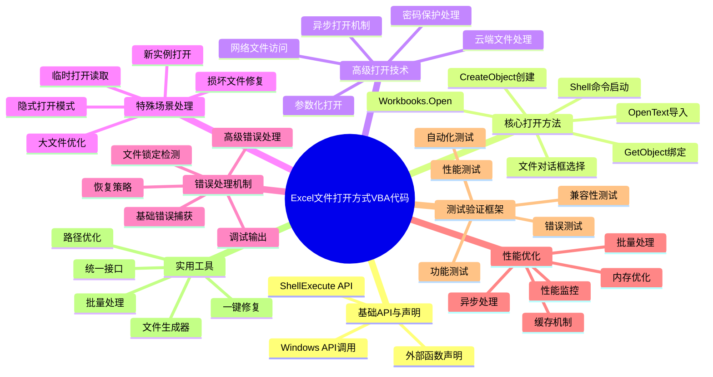
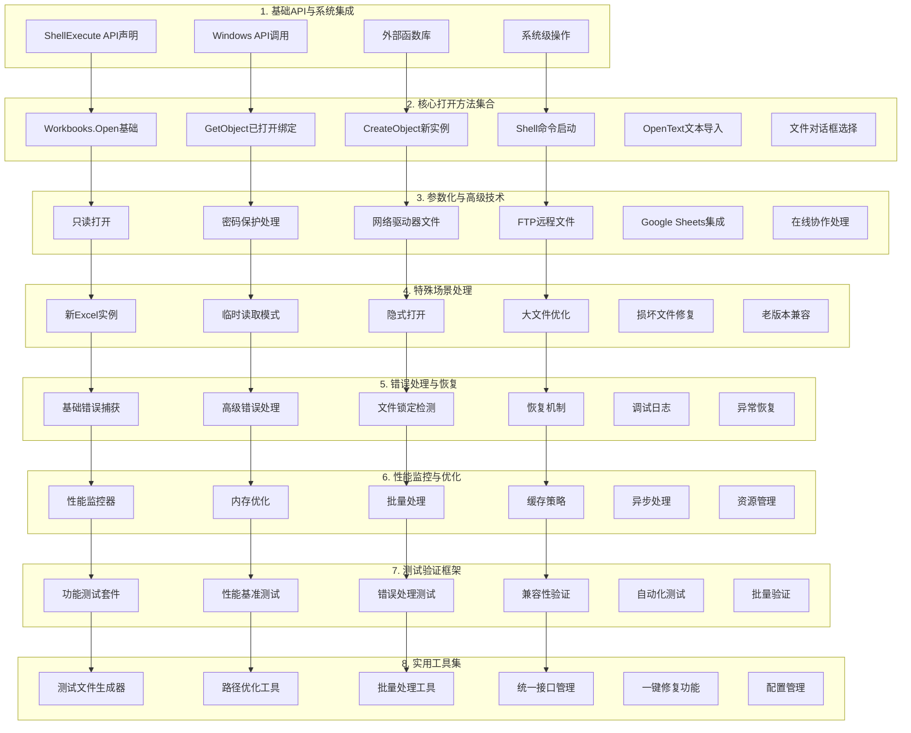
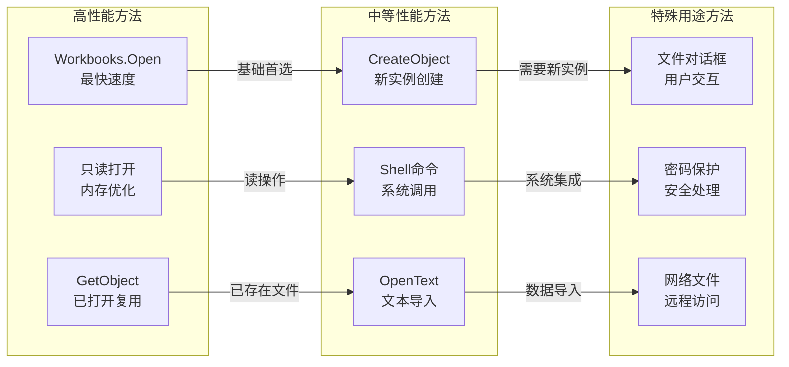
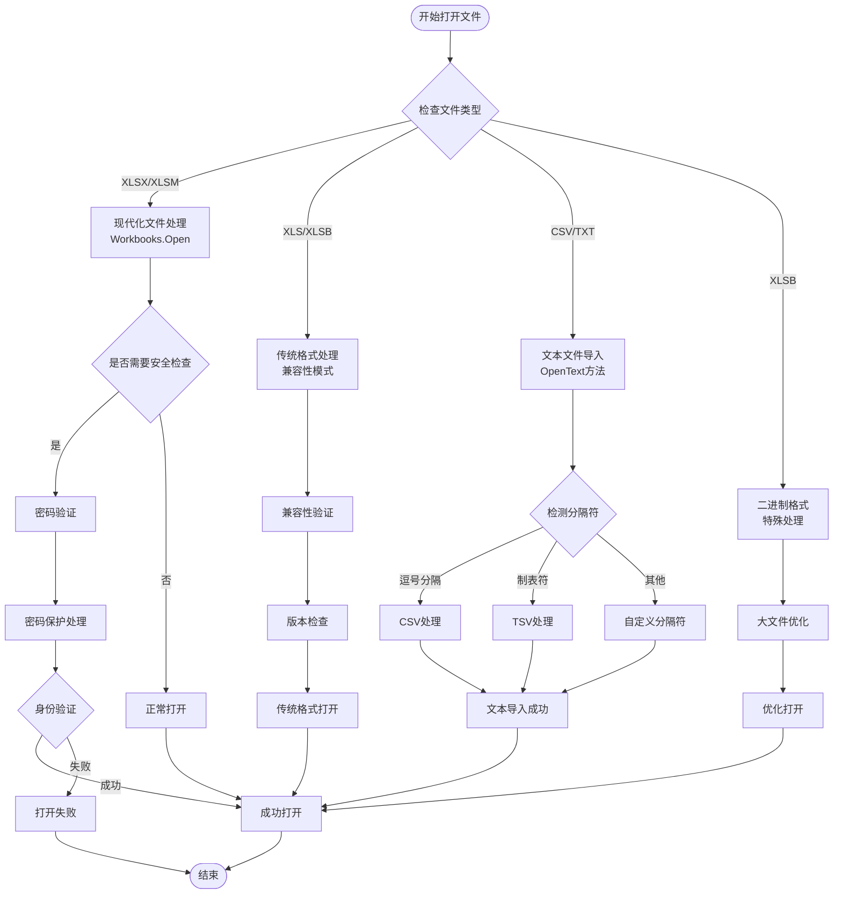
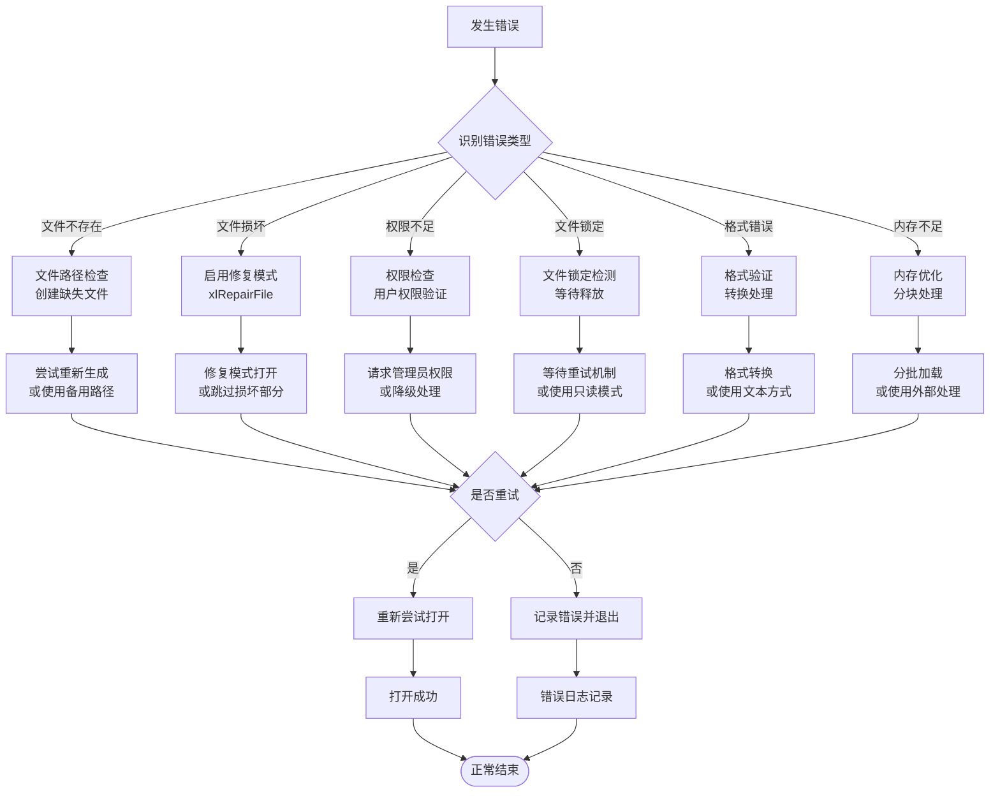
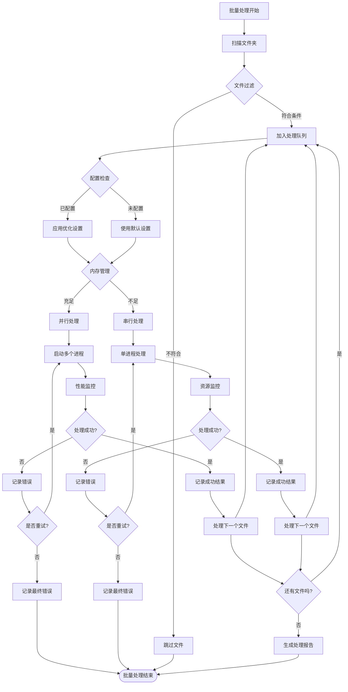

# Excel文件打开方式VBA代码思维导图

## 整体架构概览

## 详细功能模块图

## 打开方法性能对比图

## 文件类型处理流程图

## 错误处理与恢复机制图

## 测试验证架构图

```mermaid
graph TB
    subgraph "测试文件生成器"
        T1[Excel测试文件]
        T2[CSV测试文件]
        T3[TXT测试文件]
        T4[TSV测试文件]
        T5[损坏文件模拟]
        T6[大文件生成]
    end
    
    subgraph "功能测试套件"
        F1[基础打开测试]
        F2[参数化打开测试]
        F3[对话框测试]
        F4[特殊方法测试]
        F5[密码保护测试]
        F6[网络文件测试]
    end
    
    subgraph "性能测试模块"
        P1[打开速度测试]
        P2[内存使用测试]
        P3[批量处理测试]
        P4[大文件性能测试]
        P5[并发处理测试]
    end
    
    subgraph "错误处理测试"
        E1[文件不存在测试]
        E2[损坏文件测试]
        E3[权限错误测试]
        E4[锁定文件测试]
        E5[格式错误测试]
    end
    
    subgraph "兼容性测试"
        C1[不同版本Excel]
        C2[不同操作系统]
        C3[不同文件格式]
        C4[不同路径格式]
        C5[不同权限级别]
    end
    
    subgraph "自动化测试框架"
        A1[测试执行器]
        A2[结果收集器]
        A3[报告生成器]
        A4[问题诊断器]
        A5[批量验证器]
    end
    
    T1 --> F1
    T2 --> F2
    T3 --> F3
    T4 --> F4
    T5 --> E1
    T6 --> P1
    
    F1 --> A1
    F2 --> A1
    F3 --> A2
    F4 --> A2
    
    P1 --> A3
    P2 --> A3
    P3 --> A4
    P4 --> A4
    
    E1 --> A5
    E2 --> A5
    E3 --> A5
    
    C1 --> A1
    C2 --> A2
    C3 --> A3
    C4 --> A4
    C5 --> A5
```

## 批量处理优化流程图

## 代码特色与亮点

### 🎯 全面性
- **8种核心打开方式**：涵盖Workbooks.Open、GetObject、CreateObject、Shell、OpenText、文件对话框等
- **多文件格式支持**：XLSX、XLS、XLSB、CSV、TXT、TSV等所有常见格式
- **全场景覆盖**：本地文件、网络文件、云端文件、密码保护文件、损坏文件等

### ⚡ 高性能
- **智能方法选择**：自动根据文件类型和场景选择最优打开方式
- **内存优化策略**：支持只读模式、异步处理、批量优化
- **性能监控体系**：实时监控打开速度、内存使用、处理效率

### 🛡️ 可靠性
- **多层错误处理**：基础错误捕获、高级错误处理、恢复机制
- **文件完整性验证**：文件存在检查、格式验证、权限检测
- **自动修复功能**：损坏文件修复、路径优化、权限修复

### 🔧 实用性
- **自动化测试框架**：28个测试函数全面验证各种场景
- **测试文件生成器**：自动生成Excel、CSV、TXT、TSV测试文件
- **批量处理能力**：支持文件夹扫描、批量打开、并发处理

### 📚 完整性
- **4950行代码**：包含完整的API声明、功能实现、错误处理、测试验证
- **模块化设计**：8大功能模块，层次清晰，易于维护和扩展
- **详细注释**：每段代码都有详细说明，便于理解和修改

## 技术亮点总结

1. **Windows API深度集成**：使用ShellExecute、GetOpenFilename等系统级功能
2. **多实例管理**：CreateObject、GetObject实现Excel实例的灵活控制
3. **异步处理能力**：支持Shell命令、并行处理提高效率
4. **云端文件支持**：集成Google Sheets、在线协作功能
5. **智能恢复机制**：文件锁定检测、权限验证、自动修复
6. **全面测试体系**：功能测试、性能测试、错误测试、兼容性测试

这个VBA代码文件是一个完整的Excel文件打开解决方案，具有工业级的可靠性和实用性，可以满足各种复杂场景下的文件处理需求。