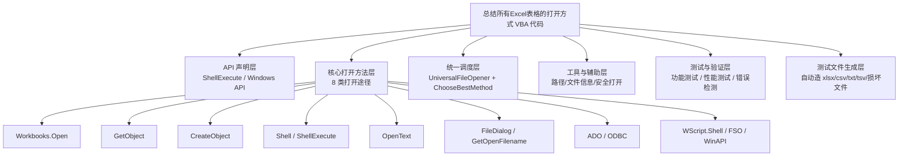
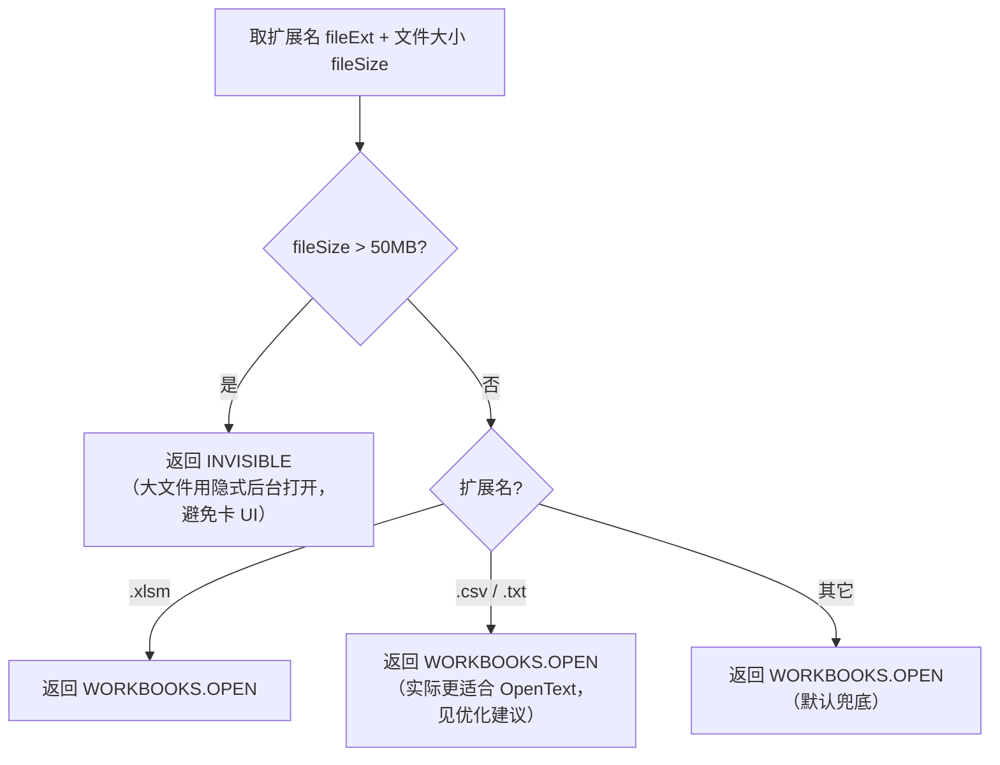
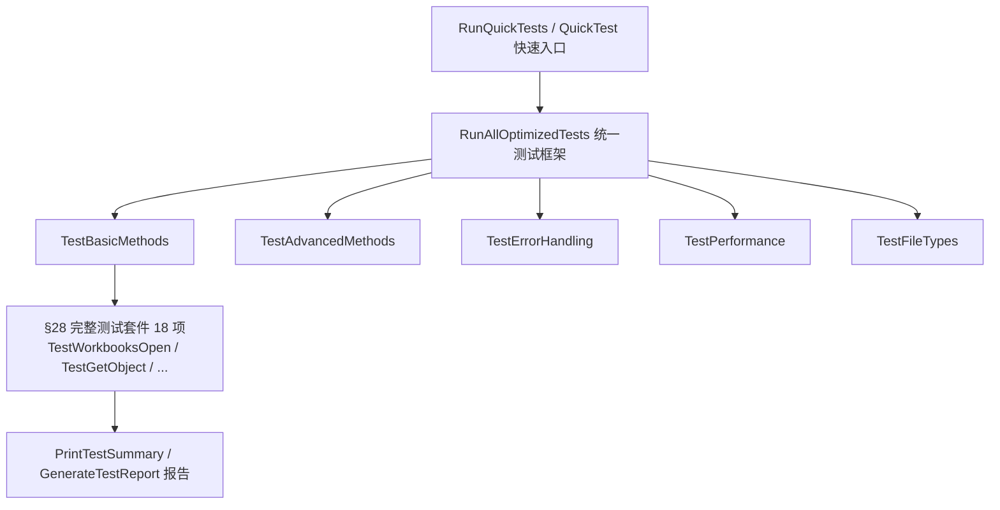
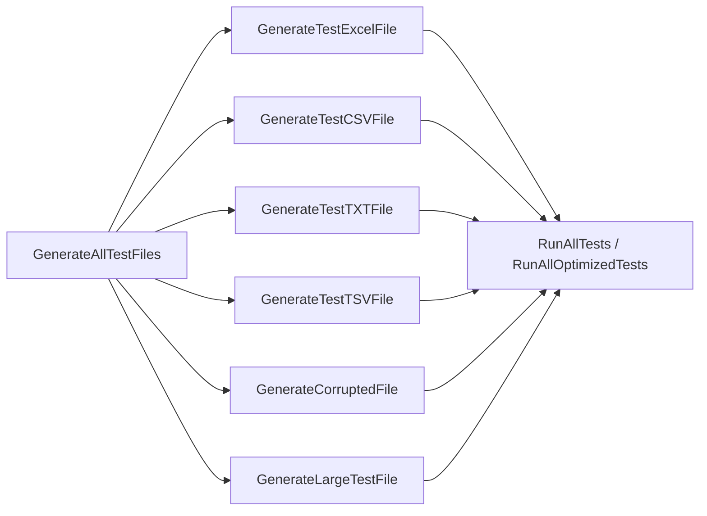

# 总结所有Excel表格的打开方式 VBA 代码 —— 逻辑梳理

> 本文档配套源文件 `总结所有Excel表格的打开方式VBA代码`（约 4900 行）使用。
> 目的：把"堆叠示例"式的代码，梳理成**清晰的逻辑脉络 + 决策流程 + 优化建议**，便于阅读、复用与二次开发。

---

## 一、文件定位与整体架构

该文件是一份 **"Excel 文件打开方式大全"**，几乎穷尽了 VBA 中打开 / 导入 Excel 及文本文件的全部途径，并配套测试、错误检测、性能监控、测试文件生成等辅助代码。

### 1. 顶层架构图

### 2. 代码的"四层结构"

| 层次 | 职责 | 代表函数 |
| --- | --- | --- |
| **声明层** | 32/64 位 API 兼容声明 | `ShellExecute` (`#If VBA7`) |
| **方法示例层** | 演示每种打开方式的用法 | `OpenExcelSimple`、`OpenUsingGetObject` 等 |
| **调度层** | 自动选最优方法并执行 | `UniversalFileOpener`、`ChooseBestMethod` |
| **支撑层** | 路径解析、文件检测、错误处理、测试、造数据 | `SafeOpenWorkbookOptimized`、`SmartPathResolver`、`GenerateAllTestFiles` |

---

## 二、8 类打开方式：决策矩阵

源文件顶部的方法对比表是全篇的"导航地图"。整理如下：

| 方法 | 速度 | 可控性 | 资源占用 | 适用场景 | 源文件章节 |
| --- | --- | --- | --- | --- | --- |
| `Workbooks.Open` | ★★★★★ | ★★★★★ | ★☆☆☆☆ | 常规自动化操作 | §1、§2、§4 |
| `GetObject` | ★★★★★ | ★★★☆☆ | ★☆☆☆☆ | 快速绑定已打开的工作簿 | §11.1 |
| `FileDialog` | ★★☆☆☆ | ★★★☆☆ | ★★☆☆☆ | 交互式选择（复杂过滤） | §3 |
| `GetOpenFilename` | ★★★☆☆ | ★★☆☆☆ | ★☆☆☆☆ | 轻量级路径选择 | §11.5 |
| `CreateObject` | ★★☆☆☆ | ★★★★☆ | ★★★★★ | 后台多进程、静默处理 | §11.2、§12.1 |
| `Shell` | ★★☆☆☆ | ★☆☆☆☆ | ★★★☆☆ | 强制启动新 Excel 进程 | §11.3 |
| `ShellExecute` | ★☆☆☆☆ | ☆☆☆☆☆ | ★☆☆☆☆ | 系统级打开（非 VBA 控制） | §11.4 |
| `OpenText` | ★★★★☆ | ★★★★☆ | ★★☆☆☆ | 结构化文本导入（CSV/TXT） | §8 |

### 选择建议（按优先级）

- **速度优先**：`GetObject` > `Workbooks.Open` > `OpenText`
- **可控性优先**：`Workbooks.Open` > `OpenText` > `CreateObject`
- **资源优先**：`GetObject` = `Workbooks.Open` > `GetOpenFilename`
- **自动化优先**：`Workbooks.Open` > `CreateObject` > `GetObject`
- **交互优先**：`FileDialog` > `GetOpenFilename` > `ShellExecute`

---

## 三、核心调度逻辑（全篇的"大脑"）

### 1. 统一入口：`UniversalFileOpener`

这是全篇最重要的函数，把"多种打开方式"收敛成**一个入口**，逻辑为"自动选方法 → 分发执行"。

### 2. 自动选方法：`ChooseBestMethod`

根据**文件大小 + 扩展名**做决策：

> **逻辑评价**：当前 `ChooseBestMethod` 实质上对绝大多数情况都返回 `WORKBOOKS.OPEN`，决策粒度较粗。优化方向见第六节。

---

## 四、按"功能主线"重新梳理（解决章节乱序）

源文件章节编号存在乱序（1,2,3…9,11,12,13,14,19,20…24,10,15,16,17,18,34,35,36,25,26…33,39）。
下面按**功能主线**重组，便于按需查阅。

### 主线 A：打开方法本身

| 功能 | 关键函数 | 要点 |
| --- | --- | --- |
| 基础打开 | `OpenExcelSimple`、`OpenExcelToSpecificSheet` | 最简形式 + 激活指定表 |
| 参数化打开 | `OpenExcelWithCommonParameters` | 完整参数清单（只读/链接/密码/修复等） |
| 只读 / 不更新链接 | `OpenExcelReadOnly`、`OpenExcelNoUpdateLinks` | 常用安全开关 |
| 对话框选择 | `OpenExcelWithDialog`、`OpenMultipleExcelFiles` | 单选 / 多选批量打开 |
| 损坏文件 / CSV | `OpenCorruptedFile`、`OpenCSVFile` | `CorruptLoad:=xlRepairFile` 修复模式 |
| 密码保护 | `OpenProtectedExcel`、`HandlePasswordDialog` | 打开密码 / 写入密码 / 对话框处理 |
| 高级途径 | `OpenUsingGetObject`/`CreateObject`/`Shell`/`ShellExecute`/`GetOpenFilename`/`ADO`/`ODBC` | §11 系列示例 |
| 特殊场景 | `OpenInNewInstance`、`TemporaryOpenForReading`、`OpenInvisible` | 新实例 / 临时读取 / 隐式 |
| 文件类型适配 | `OpenOldExcelFormat`、`OpenExcelBinary`、`OpenMacroEnabledFile` | xls/xlsb/xlsm |

### 主线 B：OpenText 文本导入（§8，独立成体系）

`OpenText` 是与 `Workbooks.Open` 并列的"文本结构化导入"专用方法，源文件给了 8 个递进示例：

逻辑递进：**基础 → 格式适配 → 容错 → 统一封装**。

### 主线 C：工具与安全打开

| 函数 | 作用 | 亮点 |
| --- | --- | --- |
| `FileExists` / `GetFileInfo` | 文件存在性 / 信息 | `Dir` + `FileLen`/`FileDateTime` |
| `SafeOpenWorkbook` | 带错误处理打开 | 存在性检查 + `On Error GoTo` |
| `SafeOpenWorkbookOptimized` | **优化版**安全打开 | 关闭 ScreenUpdating/Events/Alerts + **重试 3 次** + 修复模式兜底 |
| `GetOptimizedFileInfo` | 文件信息（Dictionary） | 修复了 Dictionary 类型错误，返回对象 |
| `SmartPathResolver` | 智能路径解析 | 绝对路径直返，相对路径拼接 base |
| `GetSafeDesktopPath` | 安全桌面路径 | 替代硬编码 `C:\Users\代\Desktop\` |

### 主线 D：测试与验证（§10、§15、§26、§28、§29）

### 主线 E：错误检测与修复（§31、§32、§33、§35、§36、§39）

源文件有大量"检测编译错误 + 给修复建议"的元代码（对自身做体检）：

- `CheckForVBAErrors` → 总入口
- `CheckBasicFunctions` (返回 `Long`) / `CheckBasicFunctionsV35` (返回 `Boolean`)：**用改名规避重复定义**
- `CheckObjectReferences` / `CheckObjectReferencesV35`：同上
- `FixCompilationErrors` / `FixDictionaryTypeErrors` / `ProvideQuickFixSuggestions`：修复建议
- `OneClickFixAndVerify` / `FinalOneClickFixAndVerify`：一键修复 + 验证

---

## 五、关键函数调用链

### 1. 安全打开（推荐使用路径）

### 2. 测试文件生成 → 测试执行

---

## 六、已修复的问题（本次优化）

| # | 位置 | 问题 | 修复 |
| --- | --- | --- | --- |
| 1 | 原 §25.1 `SafeOpenWorkbookOptimized` | `TimeValue("00:00:00:" & (attempts*100))` 毫秒格式非法，运行时报错 | 改为 `TimeSerial(0,0,attempts)` 按秒递增等待 |
| 2 | `ResetTestEnvironment` | 引用未声明的模块级变量 `fso`、`dict`，在 `Option Explicit` 下**编译失败** | 移除两行 `Set ... = Nothing`，并加注释说明 |
| 3 | 原 §10 区 `RunQuickTests` | 与 §10 后段 `RunQuickTests` **完全重复定义**，编译报"二义性名称" | 删除第二份重复定义 |
| 4 | `RunQuickTests` / `PerformanceMonitorTest` | `Timer` 返回秒，却 `/ 1000`，导致耗时显示偏小 1000 倍 | 去掉 `/ 1000`，保留"秒"语义 |

---

## 七、待优化建议（按优先级）

### P0 — 影响正确性

1. **`Timer / 1000` 残留**：§28 测试套件、`GenerateTestReport`、`TestFunction` 中仍有 8 处 `Format(... / 1000, ...)`，应统一去掉 `/ 1000`（单位本就是秒）。
2. **硬编码用户路径**：全篇大量 `C:\Users\代\Desktop\...`。建议统一替换为 `GetSafeDesktopPath()` 或 `Environ("USERPROFILE") & "\Desktop\"`。
3. **`ChooseBestMethod` 决策过粗**：CSV/TXT 实际应路由到 `OpenText`（§8），而非 `Workbooks.Open`；建议按扩展名细分。
4. **`UniversalFileOpener` 缺错误处理**：`Workbooks.Open` 失败时 `wb.Name` 会再次报错；建议包裹 `On Error` 并对 `wb Is Nothing` 判空。

### P1 — 可维护性

5. **章节编号乱序**：建议重排为连续编号（1…N），或改为按"主线 A–E"分组命名，避免阅读跳脱。
6. **注释乱码**：顶部部分注释出现 `???`/`??`（应为 emoji，编码丢失）。建议统一用 ASCII 标记（如 `[导航]`、`[提示]`）替代 emoji，避免编码问题。
7. **"检测/修复"元代码膨胀**：§31–§39 占据近 1500 行，多为对自身的体检与修复建议，与"打开方式"主题关系弱。建议拆分到独立模块 `ErrorCheck.bas`。
8. **`CheckBasicFunctions` 双版本**：用 `V35` 后缀规避重复定义，是历史包袱。建议保留一个返回 `Boolean` 的版本，删除 `Long` 版本及所有调用点迁移。

### P2 — 性能与体验

9. **`SafeOpenWorkbookOptimized` 重试间隔**：现改为 1/2/3 秒，对小文件偏长；可改为 `attempts * 0.5` 秒（用 `TimeSerial` 的秒级最小步进，或 `DoEvents` 循环微等待）。
10. **`OpenAllExcelFilesInFolder` 用 `Dir` 循环**：无法递归子文件夹；可改用 `FileSystemObject` 递归。
11. **批量打开未限流**：`OpenMultipleExcelFiles` 一次性打开全部可能耗尽内存；建议加"上限 + 进度提示"。

---

## 八、快速使用指南

### 我想……应该用哪个函数？

| 需求 | 推荐入口函数 |
| --- | --- |
| 日常打开一个 Excel | `OpenExcelSimple` / `SafeOpenWorkbook` |
| 稳健打开（可能损坏/被占用） | `SafeOpenWorkbookOptimized` |
| 让程序自动选方法 | `UniversalFileOpener(filePath)` |
| 用户交互选择文件 | `OpenExcelWithDialog` / `OpenUsingGetOpenFilename` |
| 批量打开整文件夹 | `OpenAllExcelFilesInFolder` |
| 打开 CSV/TXT 并分列 | `UnifiedOpenTextProcessor` / `BasicOpenTextExample` |
| 隐式后台处理大文件 | `OpenInvisible`（或 `UniversalFileOpener` 选 INVISIBLE） |
| 绑定已打开的工作簿 | `OpenUsingGetObject` |
| 一键自检代码 | `FinalOneClickFixAndVerify` |
| 跑全部测试 | `RunAllTests` / `RunAllOptimizedTests` |

---

## 九、逻辑总结一句话

> **以 `Workbooks.Open` 为绝对主力，`OpenText` 处理结构化文本，`GetObject/CreateObject` 应对实例与后台场景，`Shell/ShellExecute` 兜底系统级打开；上层用 `UniversalFileOpener + ChooseBestMethod` 收敛为统一入口，下层用 `SafeOpenWorkbookOptimized` 做带重试与修复的稳健打开，外围辅以测试、错误检测与测试文件生成构成完整闭环。**
