---
AIGC:
  ContentProducer: '001191110102MAD55U9H0F10002'
  ContentPropagator: '001191110102MAD55U9H0F10002'
  Label: '1'
  ProduceID: 'ae01f265-2e06-4650-9d2e-59b29f2ff1eb'
  PropagateID: 'ae01f265-2e06-4650-9d2e-59b29f2ff1eb'
  ReservedCode1: '91ae6aa0-e720-47db-bc9a-bd5930f7b20f'
  ReservedCode2: '91ae6aa0-e720-47db-bc9a-bd5930f7b20f'
---

# ColorTxt（彩读）状态机架构分析

> 项目：GitHub [ssnangua/ColorTxt](https://github.com/ssnangua/ColorTxt)（本地 TXT 小说阅读器）
> 分析版本：v3.8.11 ｜ 技术栈：Electron 35 + Vue 3 + Monaco Editor + TypeScript
> 方法：源码级静态 + 动态追踪，所有结论标注 `文件:行号`（相对 `src/`）
> 姊妹篇：《ColorTxt项目深度分析报告.md》（静态架构与功能模块）、《ColorTxt运行逻辑全流程深度剖析.md》（运行过程线）

---

## 一、总体架构与状态机地图

ColorTxt 采用 Electron 标准三层进程模型：**主进程**（`src/main`）持有系统侧能力与"无状态服务"（TTS 合成、词典、RAG、书源引擎），**Preload**（`src/preload/index.ts`）仅把 IPC 通道包装为 `window.colorTxt.*`，**渲染进程**（`src/renderer/src`）持有绝大多数**会话级状态机**（阅读、语音朗读、AI 交互、找书 UI）。`src/shared` 提供跨层类型与常量。

| 状态机 | 所属模块 | 状态持有方 | 核心状态 |
| --- | --- | --- | --- |
| 应用/窗口生命周期 | `main/index.ts` + `windowFactory.ts` + `windowCloseGuard.ts` | 主进程 | 启动序列、关窗守卫、退出收尾 |
| 阅读会话（文件加载） | `useAppFileSession.ts` + `useTxtStreamPipeline.ts` | 渲染进程 | `loading` / 流式 `phase` / 竞态代际 |
| 持久化落盘 | `useAppPersistence.ts` | 渲染进程 | 门控 `gated`/`forced` / 防抖 / flush |
| 语音朗读 | `useAppVoiceRead.ts` + `voiceReadLinePlayer.ts` | 渲染进程（主进程仅无状态合成） | `off`/`playing`/`paused` + 合成阶段 `ai`/`tts` |
| 书源搜索 | `searchService.ts` + `useBookSource.ts` | 主进程会话 + 渲染代际 | `Idle`/`Searching`/`LoadingMore`/`Completed`/`Stopped` |
| 章节加载与缓存 | `getChapterContentWithCache.ts` + `useFindBookChapterSession.ts` | 主进程缓存 + 渲染会话 | 缓存命中/未命中/联网/渲染 |
| 整书下载 | `downloadService.ts` + `useBookSource.ts` | 主进程会话 | 排队/缓存/导出/取消 |
| 后台 WebView 会话 | `backstageWebView.ts` + `sourceVerification.ts` | 主进程 | 登录/验证码/JS 挑战重试 |
| AI 向量索引 | `buildBookVectorIndex.ts` + `embedding/*` | 主进程(嵌入 worker) + 渲染(阶段) | `chunking`/`embedding`/`indexing`/就绪/失效 |
| AI Agent 对话 | `agentChat.ts` + `chat.ts` | 主进程 | 流式回合/工具调用/收尾/中断 |
| 文生图/角色卡 | `characterPortrait.ts` + `txt2img/index.ts` | 主进程单例会话 | 检索/生成/中止 |
| AI 智能排版 | `useAiSmartFormat.ts` + `useReaderSmartFormatDiff.ts` | 渲染进程 | 运行/中断/Diff 预览/应用/放弃 |

---

## 二、应用/窗口生命周期状态机

### 2.1 启动序列

启动入口 `main/index.ts:87-110`。协议在 `app.ready` 之前注册（`index.ts:32-43`），`whenReady` 后分支决定开主窗还是找书窗（`--find-book` 标志），并注册全局快捷键。

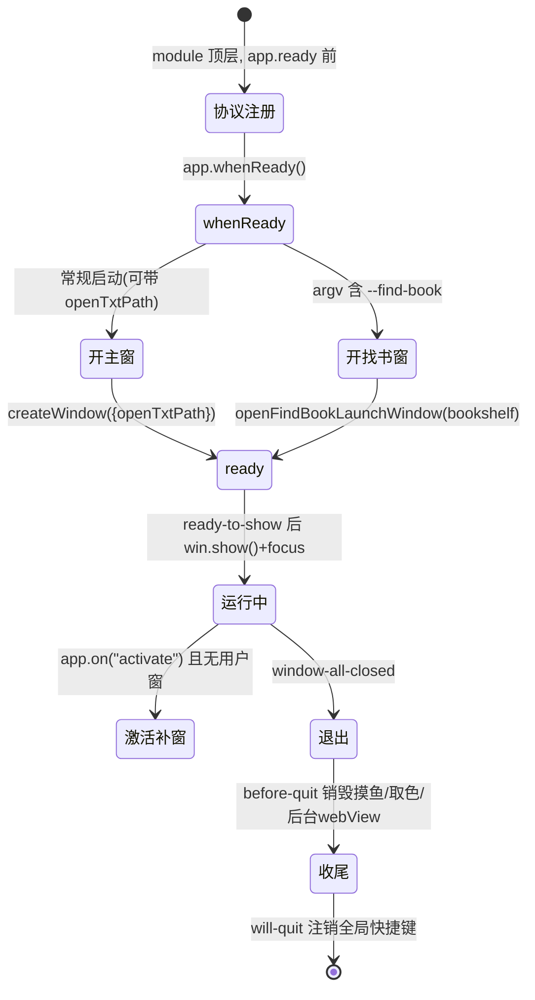

### 2.2 关窗守卫（防误关/防退出残留）

`windowCloseGuard.ts` 是典型的"二次确认"状态机：首次关窗由渲染进程决定是否 `preventDefault`，确认后经 `window:proceedClose` 再次 `close()` 才真正放行；`allowNextClose` 用 WeakSet 记录一次性放行，`appIsQuitting` 标志在 `app.quit()` 阶段绕过拦截。

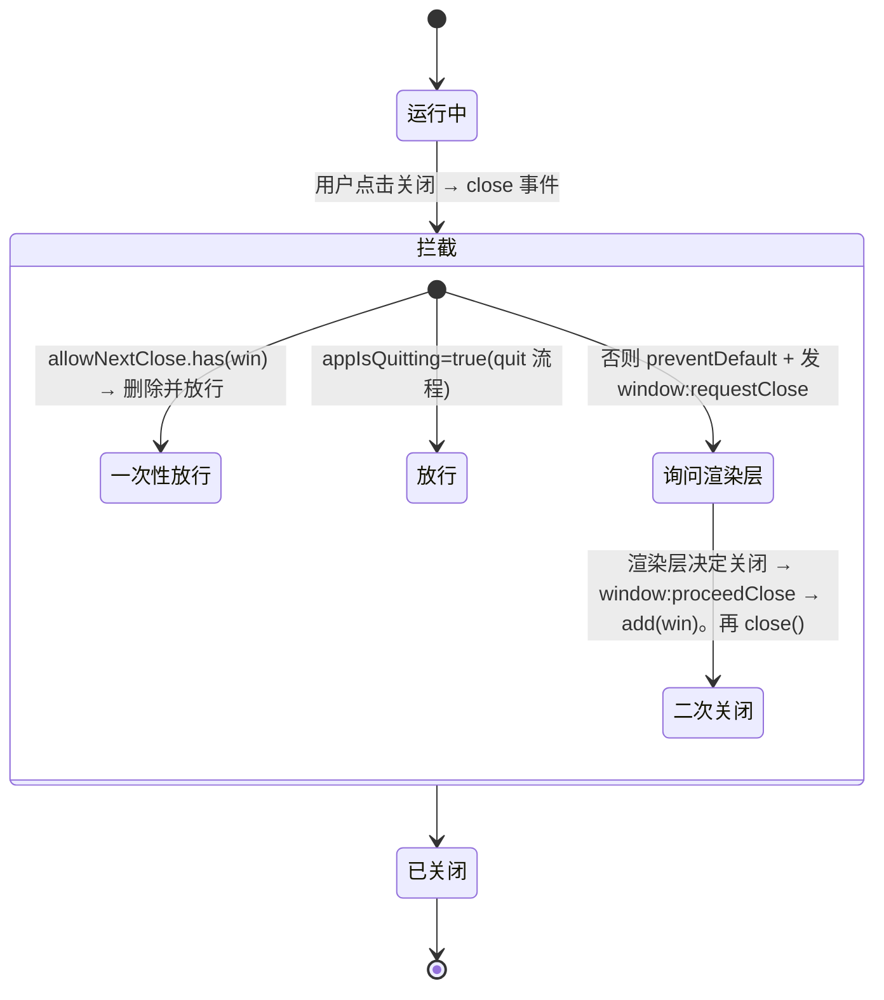

证据：`windowCloseGuard.ts:3-6`（`allowNextClose` WeakSet、`appIsQuitting`）、`17-22`（proceedClose 放行）、`29-41`（attachWindowCloseRequestGuard 拦截逻辑）；`index.ts:118-129`（before-quit / will-quit / window-all-closed 收尾）。

### 2.3 多窗口互斥与清理

`windowFactory.ts` 用四张 Map（`shouldRestoreSession` / `pendingOpenTxt` / `findBookWindow` / `findBookInitialTab`）以 `windowId` 为键管理窗口态；窗口 `closed` 时清空 Map，并在"无剩余用户窗"时强拆后台 WebView、取色覆盖层、摸鱼窗（`windowFactory.ts:110-128`）。用户窗白名单见 `openTxtInMainWindow.ts:9-21`（排除 findBook / backstage / eyedropper / stealth）。

---

## 三、阅读会话状态机（文件加载）

### 3.1 流式加载管线

渲染进程无 Node fs，文件内容经 `file:stream-start / stream-chunk / stream-end` 三段 IPC 推入（`ipcHandlers.ts`），主进程用 `createReadStream(…{highWaterMark:256KB})` 分块。渲染层以 `activeStreamRequestId` 校验每个 chunk 属于当前流，防御快速切书时旧流迟到 chunk 污染新会话。

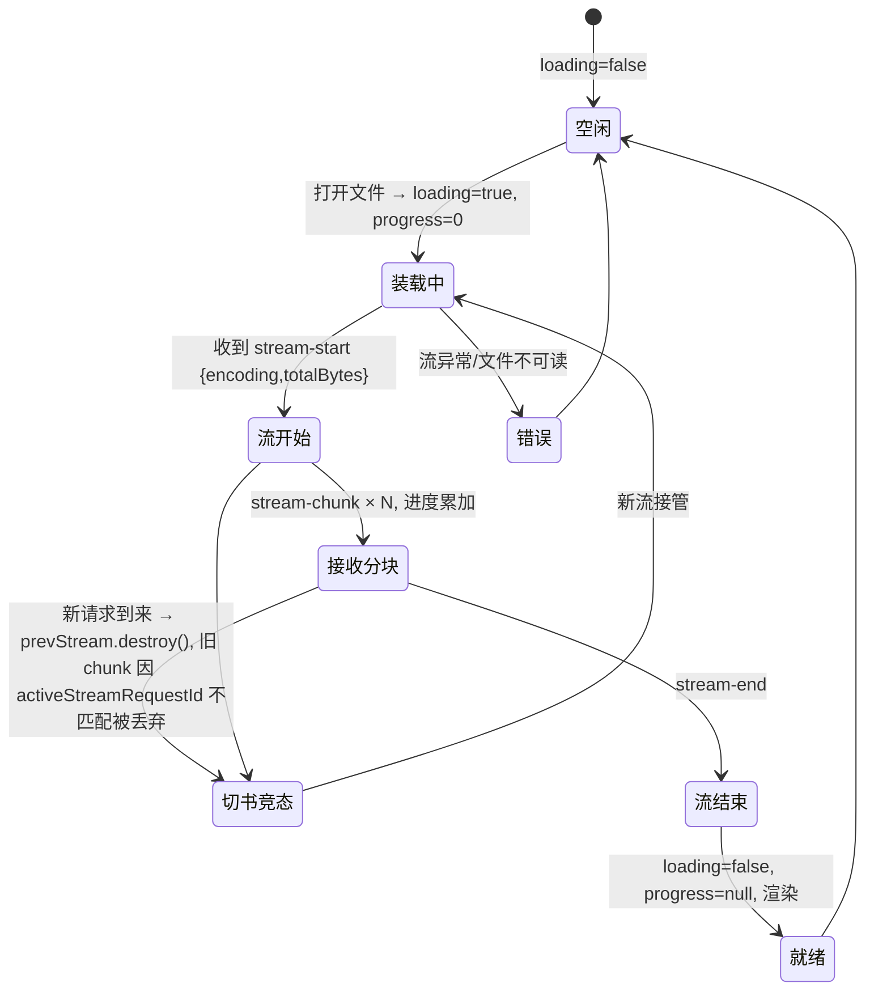

证据：`useAppFileSession.ts:75-76`（`loading`/`loadingProgressPercent` 状态）、`411-412`（置 loading）、`355-356`（复位）、`902`（`p.phase === "start"` 流阶段判断）；运行逻辑报告已论证 `activeStreamRequestId` 竞态防御（`useAppWindowBindings.ts`）。

### 3.2 持久化落盘门控

`useAppPersistence.ts` 是贯穿全文的落盘体系，核心是"门控 + 防抖 + 多窗合并 + 强制 flush"：进度/书签等元数据写入先入 `pendingFileMetaWrite`，按 `gated`/`forced` 两级优先级合并（`force > gate`），窗口关闭或关键时机 `flush` 强制落盘。

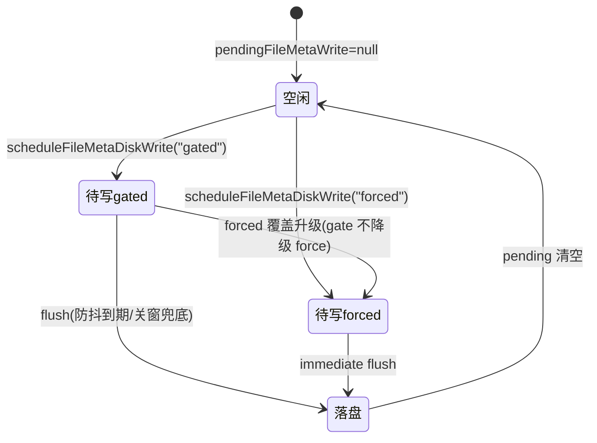

证据：`useAppPersistence.ts:541-556`（`mergePendingFileMetaMode`：forced 不被 gated 降级）、`618-627`（`scheduleFileMetaDiskWrite`）、`709`（gated 调度）、`985`（forced 调度）、`725`（`flushRecentFilesAndFileMetaToDisk`）。

---

## 四、语音朗读状态机

### 4.1 分层概览

主进程 `voiceRead/`、`voiceReadEdgeTts.ts`、`ai/voiceReadSpeaker.ts` 都是**无状态的单次合成/分类服务**；真正的会话状态机在渲染进程：顶层 `useAppVoiceRead.ts`（会话三态 `off/playing/paused`）+ `voiceReadLinePlayer.ts`（播放器子状态，用代数式会话失效 `playbackSessionGen` 而非显式枚举）。

### 4.2 顶层会话状态机

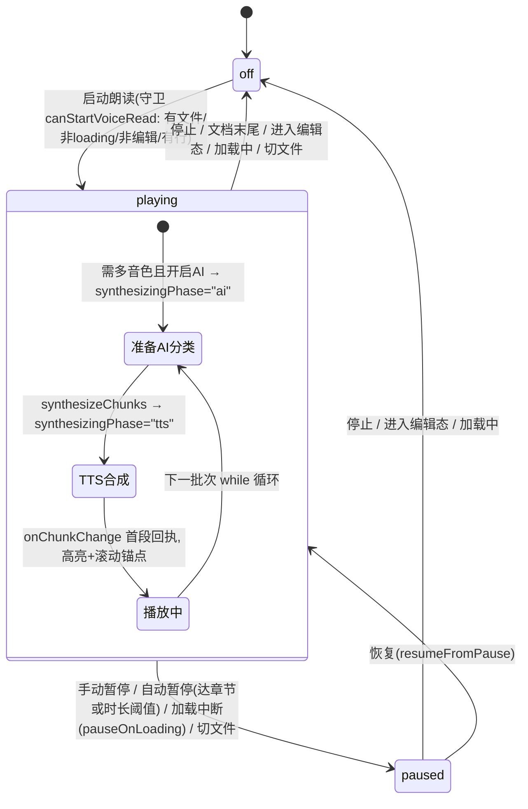

关键状态与守卫（证据：`useAppVoiceRead.ts`）：

| 状态/事件 | 守卫/条件 | 证据 |
| --- | --- | --- |
| 三态定义 | `VoiceReadMode = "off"\|"playing"\|"paused"` | `useAppVoiceRead.ts:56,86-88` |
| 合成阶段 | `synthesizingPhase = "ai"\|"tts"\|null`，`busy = prepareDepth>0 \|\| playerActive \|\| ttsBridge` | `useAppVoiceRead.ts:112-122` |
| 启动守卫 | `canStartVoiceRead`：当前文件非空且非 loading 且非编辑态且行数>0 | `useAppVoiceRead.ts:1132-1139` |
| 循环有效性 | `isPlaybackAlive(gen,mode)`：`gen===playbackLoopGen && mode!=="off"` | `useAppVoiceRead.ts:163-165` |
| 暂停挂起 | `waitIfPaused()`：while(paused) 挂到 `resumeWaiters` | `useAppVoiceRead.ts:200-206` |
| 自动暂停 | 时长模式 1s 轮询累计；章节模式预扫换章点 | `useAppVoiceRead.ts:170-198,447-492` |
| 播放器停止三态 | `stop()` / `pausePlayback()` / `stopForLineJump()` 均走 `abortActivePlayback()`（作废异步+关 AudioContext+取消 speechSynthesis） | `voiceReadLinePlayer.ts:880,889,899,1037-1082` |
| 排播完成判定 | `currentTime >= scheduledEnd-0.05` | `voiceReadLinePlayer.ts:468-474` |

### 4.3 多音色/合成限流

多音色（`VoiceReadScheme = "single"|"multi"`，`voiceReadProfiles.ts:27`）**不改变会话状态**，只改变每个 chunk 的合成输入（音色/情绪/角色卡）；有对白段且开启 AI 时进入 `ai` 合成阶段，否则直达 TTS。主进程设全局串行限流防 HTTP 429：`dashscopeSynthQueue.ts:23-40` / `volcengineSynthQueue.ts:23-73` 用链表 Promise 槽 + 280ms 最小间隔 + 5 次指数退避；Edge 单次重试 3 次（`voiceReadEdgeTts.ts:377-395`）。渲染层 Edge 维持 4 段在途缓冲（`EDGE_BUFFER_SIZE=4`，`voiceReadLinePlayer.ts:286`）。

IPC 合成通道：`voiceRead:synthesize / cancelSynthesis / listVoices / healthCheck`（`shared/voiceReadSynthesisIpc.ts:10-14`），主进程以 `senderId:requestId` 为键挂 `AbortController`，同键新请求先 abort 旧请求（`registerVoiceReadIpc.ts:97-126`）。

### 4.4 端到端合并时序图（合成阶段 → 引擎预处理 → 主进程合成）

纵贯三层的一条真实链路：会话层 `useAppVoiceRead` 先经过 **AI 分类 / TTS 两段合成阶段**，再交给播放器 `voiceReadLinePlayer` 按引擎分流——**Edge 走「预热 4 段 + 生产者/消费者缓冲」**，**云 TTS（DashScope/Volcengine）走主进程串行限流槽**。两类引擎在主进程都是无状态单次合成。

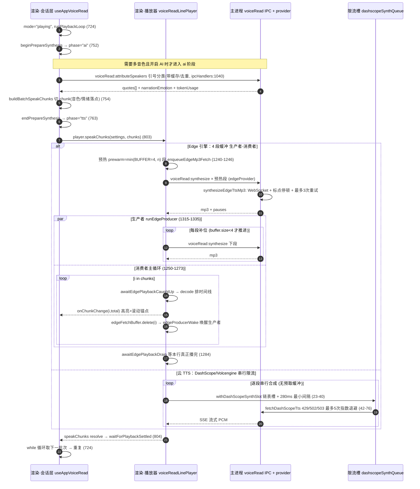

时序图要点：

- **AI/TTS 阶段是会话层的两个连续窗口**：`beginPrepareSynthesis` 置 `phase="ai"` → `buildBatchSpeakChunks` 内若需多音色则先经 `voiceRead:attributeSpeakers` 做引号/说话人分类 → `endPrepareSynthesis` 回落到 `phase="tts"`（`useAppVoiceRead.ts:112-122` 的 `syncSynthesizingState` 派生）。
- **Edge 的 4 段缓冲是「预热 + 双循环」**：生产者在 `edgeFetchBuffer.size >= BUFFER` 时挂起等待 `edgeProducerWake`（`voiceReadLinePlayer.ts:1323-1329`），消费者每播完一段 `delete(i)` 并 `wake()` 生产者（`voiceReadLinePlayer.ts:1271-1272`）。
- **云 TTS 无缓冲、只串行限流**：其 4 段预取被 `voiceReadRequiresSerialChunkFetch()` 语义替代（`voiceReadEngineRouting.ts:34-43`），靠主进程 `withDashScopeSynthSlot` 的链表槽 + 最小间隔防 429。
- Edge 的"3 次重试"在 `voiceReadEdgeTts.ts:377-395`，云 TTS 的"5 次退避"在 `dashscopeSynthQueue.ts:49-54`，二者对称但方向相反：一个为稳定订阅、一个为限流避让。

---

## 五、书源找书状态机

### 5.1 搜索流程

主进程持有 `SearchSession`（`searchService.ts:110-122`），渲染层以 `searchSeq` 自增代际丢弃迟到事件。

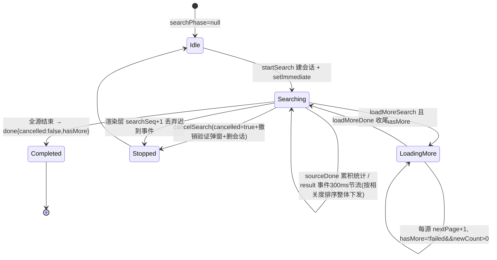

关键点：并发池 `SOURCE_CONCURRENCY=4`（`searchService.ts:70`）；单源超时 30s，验证码激活时延展到 600s，`settle` 防双解（`searchService.ts:23-68`）；分页能力需 searchUrl 含 `{{page}}`/`<a,b>`/`@js:`（`searchService.ts:133-141`）。

### 5.2 章节加载与缓存

主进程 `getChapterContentWithCache.ts` 统一"读缓存→回写→再回写"闭环；渲染层 `useFindBookChapterSession.ts` 以 `loadSeq` 作废旧请求。

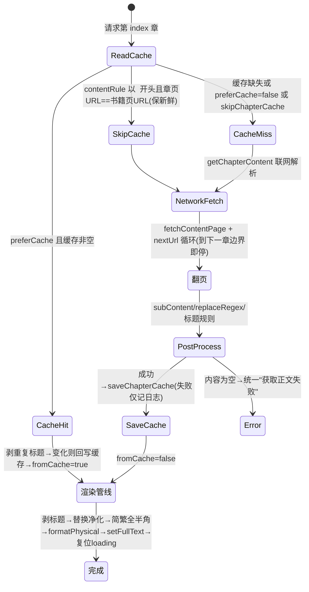

缓存布局：`userData/book_cache` + 书名前 9 字 + `md5-16(bookUrl)` + 章节 `md5-16(chapterUrl).nb`（`chapterCache.ts:22-34`）。渲染层预判命中时不显示加载遮罩（`useFindBookChapterSession.ts:594-599`）。

### 5.3 整书下载

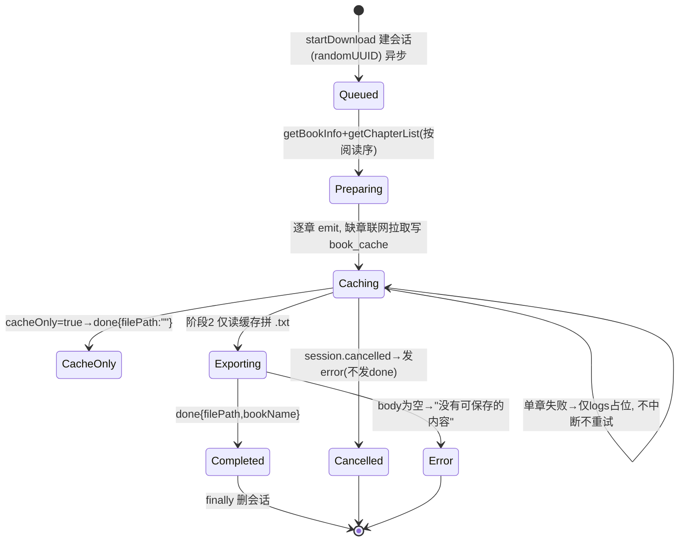

关键点：取消只置 `cancelled` 标志、循环边界检查，会话由 `finally` 统一清理（`downloadService.ts:15-26,85-95,176-243`）；导出阶段读不到的章节写 `[下载失败: 章节未缓存]` 占位（`downloadService.ts:210-213`）。

### 5.4 后台 WebView / 验证会话

手动登录/验证码/JS 挑战页触发后台隐藏 WebView（`backstageWebView.ts`），是唯一带重试的组件（空结果/挑战页重试最多 30 次 × 1s）。

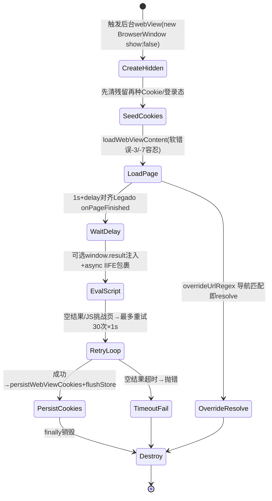

验证/登录会话由 `sourceVerification.ts` 管理，`activeWindows` 记录 browser/captcha 两类，每源判定 `hasActiveVerification` 联动搜索超时延展；搜索取消时 `dismissAllActiveVerifications()` 一并关弹窗（`sourceVerification.ts:80-86,269+,275+`）。

---

## 六、AI 功能状态机

### 6.1 向量索引构建

阶段类型 `chunking`/`embedding`/`indexing`（`buildBookVectorIndex.ts:10`）。

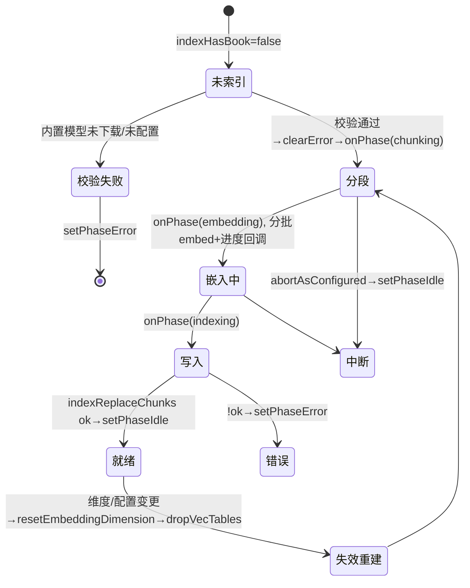

主进程嵌入子状态：`ensureBuiltinModelReady` → `MODEL_NOT_CONFIGURED/MODEL_NOT_DOWNLOADED/loadBuiltinEmbeddingModel`（`embedding/index.ts:19-27`）；worker 发 `load:progress/done/error`、`embed:progress/done/error`、`embed:abort`（`worker.ts:73-122`）。维度变化在 `vectorDb.ts:160-178` 触发 `dropVecTables+createVecTables`。

### 6.2 Agent 对话流

主循环 `runAgentChat`（`agentChat.ts:1266-1687`），流式解析 `chat.ts:389-523`。

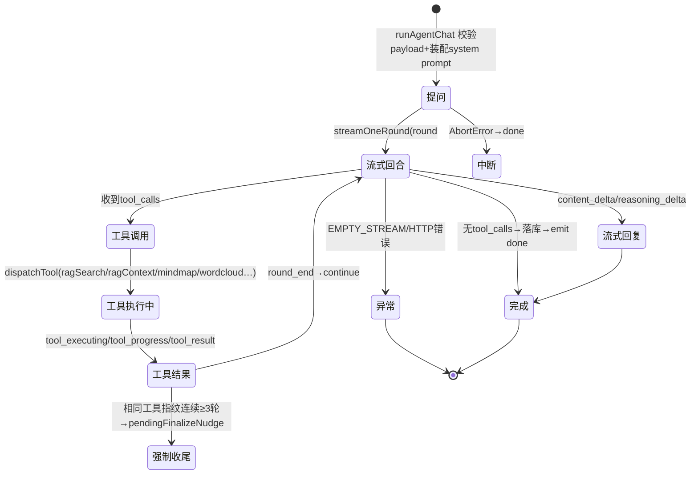

关键点：工具死循环防护（同参数指纹连续 3 轮判定错误，`agentChat.ts:1491-1508`）；`ragContext` 超 1 万字触发压缩摘要 `compressChapterToDigest`；abort 在 `chat.ts:515-518` 被归为 `done`。渲染事件 `ai:chat:chunk / done / error` 驱动 UI 状态（思考块 `sealed`、工具 `running|done|error`，`aiAssistantTypes.ts:22-50`）。

### 6.3 文生图/角色卡生成

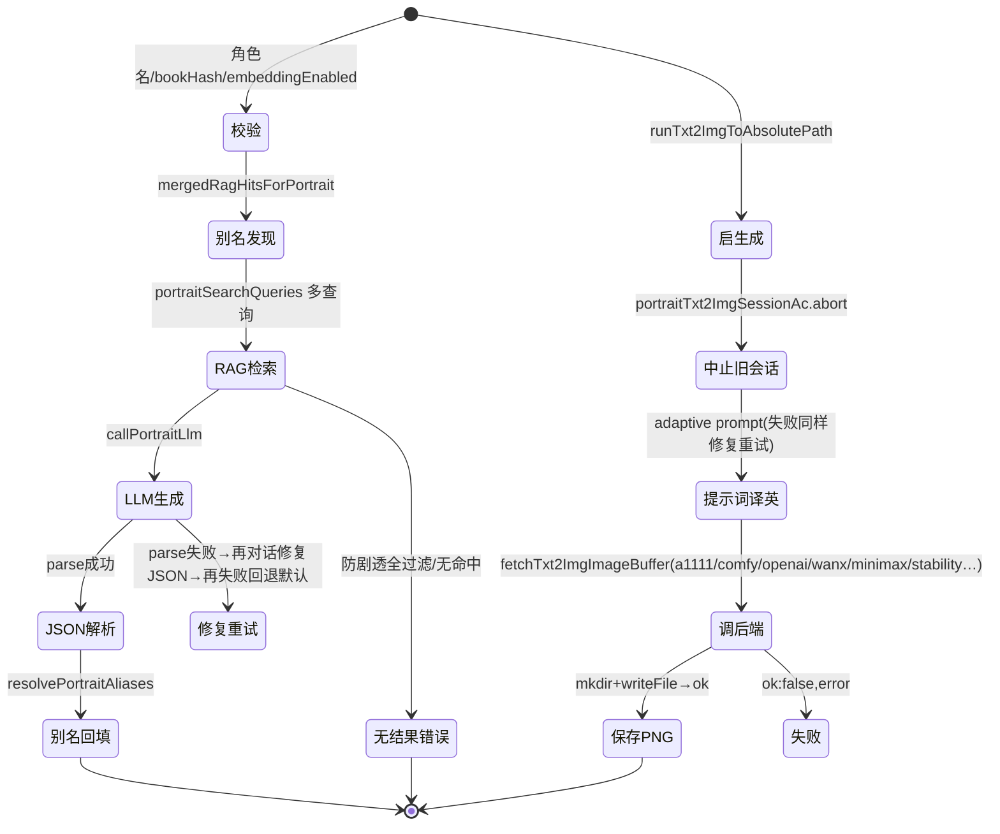

单例会话 + 中止：`portraitTxt2ImgSessionAc` 单例在每次开始生成前 abort 旧会话（`registerAiIpc.ts:107-108,1541-1544`），并有独立 `:abort` 通道（`registerAiIpc.ts:1597-1600`）。

### 6.4 AI 智能排版 Diff 预览

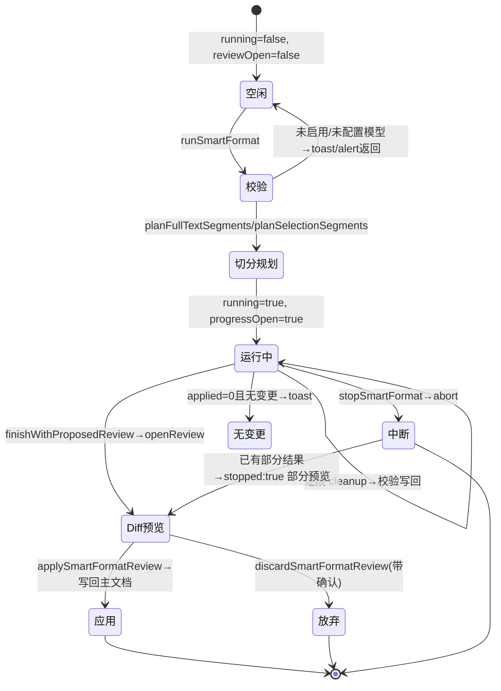

Diff 会话结构 `{startLine,endLine,originalText,proposedText,scope}`（`aiSmartFormatReviewTypes.ts:3-11`），左原文只读、右提议可编辑（`useReaderSmartFormatDiff.ts:100-114`）。底层清理服务 `textFormatCleanup.ts:212-311` 拆分子任务（硬换行/标点/引号/去广告/去水印/乱码/屏蔽还原），无 LLM 子任务时直接返回原文。

---

## 七、跨状态机设计共性

1. **主进程持会话、渲染层持代际号**：搜索 `searchSeq`、下载 `sessionGen`、章节 `loadSeq`、语音 `playbackLoopGen`、流式 `activeStreamRequestId` 同一模式——每次新操作自增代际，回调先校验代际/会话 id，迟到事件静默丢弃（`useBookSource.ts`、`useAppVoiceRead.ts`）。
2. **取消 = 标志位 + 循环边界检查，而非中断线程**：`cancelled` 只在循环头检查；搜索取消仍发一次 `done{cancelled:true}`（`searchService.ts:272-280`），下载发 `error`（`downloadService.ts:176-183`），会话由 `finally` 统一清理。
3. **失败不重试、只降级**：网络请求层无自动重试；搜索单源失败发 `sourceDone{failed}` 继续，下载单章失败占位。唯一例外是后台 WebView（30×1s）与 TTS 合成（3~5 次退避），专治 JS 挑战页与 429。
4. **缓存是"读-回写-再回写"闭环**：章节缓存既服务阅读又服务整书下载；`<js>` 动态规则跳缓存保新鲜，下载导出只读缓存、保证导出即缓存原文。
5. **状态集中持有于渲染进程，主进程提供无状态服务**：TTS、词典、RAG、书源引擎主进程均为"请求-响应"，会话状态（含 UI 状态）归渲染层 `useApp*` composables 管理，符合 Electron 安全模型（渲染层无 Node 直访）。

---

## 附：证据索引

| 状态机 | 关键文件（相对 `src/`） |
| --- | --- |
| 窗口生命周期 | `main/index.ts`、`main/windowFactory.ts`、`main/windowCloseGuard.ts`、`main/openTxtInMainWindow.ts` |
| 阅读会话 | `renderer/src/composables/useAppFileSession.ts`、`useTxtStreamPipeline.ts`、`useAppPersistence.ts` |
| 语音朗读 | `renderer/src/composables/useAppVoiceRead.ts`、`renderer/src/services/voiceRead/voiceReadLinePlayer.ts`、`main/voiceRead/*`、`main/registerVoiceReadIpc.ts` |
| 书源找书 | `main/bookSource/searchService.ts`、`downloadService.ts`、`engine/getChapterContentWithCache.ts`、`engine/chapterCache.ts`、`engine/backstageWebView.ts`、`engine/sourceVerification.ts`、`renderer/src/bookSource/*` |
| AI | `main/ai/chat/agentChat.ts`、`chat.ts`、`ai/rag/*`、`ai/tools/characterPortrait.ts`、`ai/txt2img/index.ts`、`renderer/src/ai/buildBookVectorIndex.ts`、`renderer/src/composables/useAiSmartFormat.ts`、`useReaderSmartFormatDiff.ts` |